# DST-ArknightsItemPackage

## 说明

本项目是游戏《饥荒》的 关于《明日方舟》模组的材料扩展包。同时包含一些公用库

接受提需求, 合理采纳, 欢迎提交PR

## 接入模组状况

**令** [DST-Arknights-Ling 源码](https://github.com/DST-Arknights/DST-Arknights-Ling)

**重岳** 接入中,即将发布[DST-Arknights-Chongyue 源码](https://github.com/DST-Arknights/DST-Arknights-Chongyue)

**Mon3tr** 接入中[DST-Arknights-Mon3tr 源码](https://github.com/DST-Arknights/DST-Arknights-Mon3tr)

**佩佩** 未立项

## 饼
**战术小队** 
已安装激活的模组, 可在战术小队面板召唤空投, 协同作战(含自动释放技能, 策略偏好等brain能力)

**技能偷学** 
即将实装🤗, 所有角色均可限时内使用模组角色的技能.

## 玩法包含内容

### 基础材料
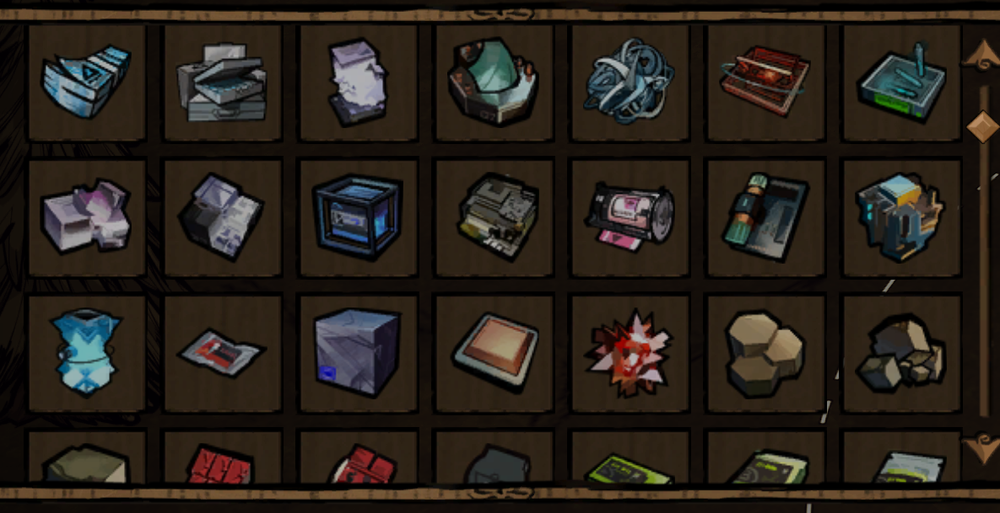

现暂停掉落.提供明日方舟基础养成材料, 供角色养成. 掉落表见详细文档 [材料掉落表](docs/ark_item_enhanced_table.md)

### 货币系统
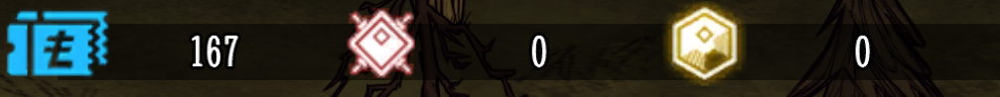

提供 龙门币, 合成玉, 源石等基础货币的管理. 用于物品配方制作.

击杀怪物时会掉落龙门币, 其余货币暂无获取来源.

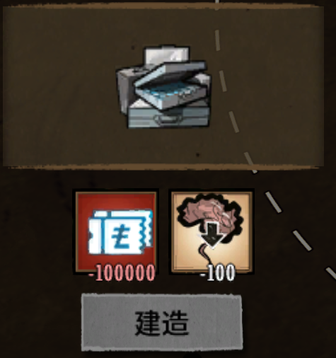

制造栏ui优化, 展示为消耗数量.

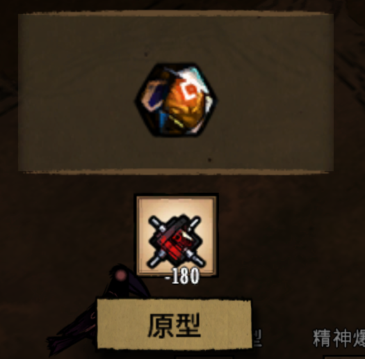

模组优化: 提供游戏设置选项, 优化Amiya模组的合成玉, 拾取合成玉后不再占用背包空间.制作阿米娅角色物品时也可以直接使用.

### 基建
#### 罗德岛加工站
**配方** 炼金引擎解锁 木炭\*10

**功能** 供玩家合成高级材料预制体, 以及龙门币交易物等.

#### 罗德岛训练站

**配方** 炼金引擎解锁 木板\*4 金块\*2

**功能** 提供角色精英化升级配方(角色自定义), 提供角色技能专精配方(角色自定义), 提供偷学技能配方(角色自定义共享)

### 精英化系统

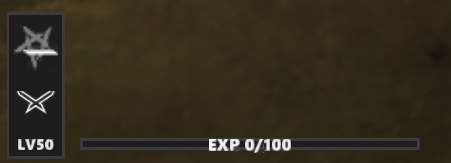

**功能** 包含角色养成所需的 等级 经验, 精英化, 潜能(未实装) 的管理.

**经验** 默认有参与战斗获取经验(支持自定义), 用于提升角色等级.

**等级** 
获取经验会提升等级, 等级可以提升角色三位属性(支持自定义). 
当本精英化阶段经验满级时, 才可以在罗德岛训练站看到精英化提升配方并提升精英化等级.

**精英化** 精英化等级提升后, 可以提升角色的基础属性上限, 解锁新的配方(角色自定义), 解锁新的能力(角色自定义).

### 技能系统
该系统无角色限制,所有官方角色均可使用 
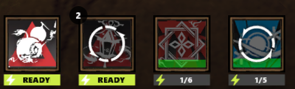 
示例技能 重进酒(令) 笑鸣瑟(令) 冲盈(重岳) 策略:超压链接(Mon3tr) 
示例的三、四技能由令偷学重岳与Mon3tr的技能而来

提供风格一致的技能ui界面.

**充能**
自动充能, 以及其他自定义充能方式(例如受击, 被击, 角色自行实现). 可累计充能层数.

**消耗**
可选给予角色一定时间的能力效果, 或者给予角色指定数量的弹药(角色自定义消耗弹药)

**触发**
仅主动技能可以通过热键或者鼠标点击图标触发. 被动以及自动触发类型的技能由角色自定义实现.主动触发类型的技能可在技能描述面板配置热键.

**等级**
技能可以升级, 升级后可以提升技能效果. 技能等级由角色模组选择配方提升或者绑定精英化提升.

**技能逻辑**
由角色自行实现, 若共享技能则要求该技能能够兼容所有角色.

**技能偷学**
角色模组可自定义共享技能, 在训练站展示偷学配方, 所有玩家与角色(包含官方角色, 非官方角色)可通过消耗配方完成偷学并装载该技能. 偷学的技能可选持续一段时间或者永久,由角色模组自定义. 偷学的技能不支持精英化提升或者技能专精提升, 仅保留基础等级.

**描述面板**

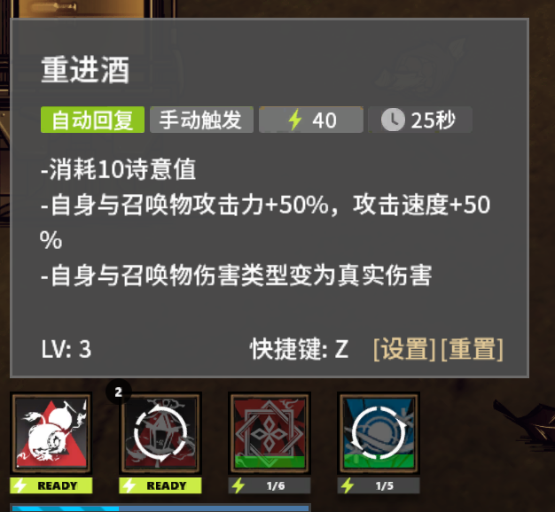

鼠标移动到技能图标上会显示技能描述面板, 展示技能效果, 以及当前等级的数值. 主动触发类型的技能可配置热键.

### 天赋系统

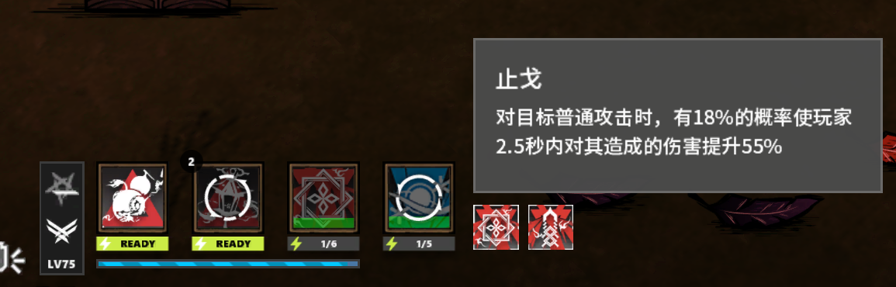

提供天赋系统, 供角色模组使用. 天赋可以提供被动能力加成, 以及一些特殊效果. 天赋的解锁可以绑定精英化等级, 也可以绑定其他条件(角色自定义实现).

### Buff图标系统

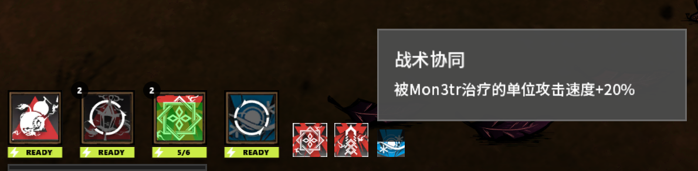

角色可自定义Buff图标. 当任意玩家被施加该buff后均会展示该图标介绍内容. buff可展示层数, 以及剩余持续时间.(示例图的buff由Mon3tr的策略:超压链接技能自动施加)

### 明日方舟系列表情包
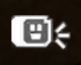
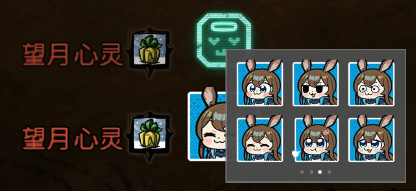 
所有角色ui均包含一个表情按钮, 点击后会弹出表情包界面. 再次点击关闭.滚轮切换页面.
角色可添加自己的专属表情包, 仅对应角色可发送

## 内置开发工具
用作便捷开发. 详情待补充, 可见源码
* 国际化PO文件合并 ark_i18n
* 国际化语音定义 component/i18n_talker
* 日志系统 ark_logger
* 属性无冲修改器 modifier_installer
* 防具, 武器, 生命值扩展 armor_extension, combat_extension, health_extension
* Widget扩展 widget_extension
* NetState 事件机制 net_state
* 事件优先回调机制 priority_event_callback
* SafeCall 安全调用 safe_call
* Symbol 符号 symbol
* 热键管理 ark_hotkey
* 束缚控制系统 component/immobilizable
* ~~静默打开容器 ark_item_container~~
