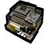
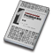

# DST-ArknightsItemPackage

## 说明

本项目是游戏《饥荒》的 关于《明日方舟》模组的材料扩展包。

接受提需求

## 包含内容

* 基础材料: 所有的基础材料预置体
* 货币系统: 龙门币
* 基建: 罗德岛加工站 罗德岛仓库
* 背包: 罗德岛背包

### 基础材料

#### 获取方式
* 生物死亡时掉落
* 在基建 "罗德岛加工站" 中合成

### 货币系统

#### 获取方式
* 击杀生物时,击杀玩家获得生物血量数量的龙门币
* 使用 在罗德岛加工站制作的 "一小捆龙门币" 等物品

### 基建

#### 罗德岛加工站

通过二级科技站解锁建造, 玩家靠近建筑时可以合成高级材料预制体

"一小捆龙门币", "一大捆龙门币" 等龙门币交易物也是从这里合成

#### 罗德岛背包

通过二级科技站解锁建造, 在 "服装"分类下可以制作

**相较于其他背包,有如下便利与限制:**
* 背包只需携带在身上，无需装备。
* 背包只能放入罗德岛材料，无法放入其他物品。
* 无论背包是否打开，拾取或给予的所有材料都会优先放入背包，除非背包已满。
* 制作物品时，无论背包是否打开，材料都会自动从背包中取出。
* 背包把材料分为多个类别，每个材料有固定位置，无法手动调整。推荐使用 `SHIFT` + `左键` 放入材料。
* 当背包在物品栏处于关闭状态时, 若获得罗德岛材料物品并已经自动入包, 这个小包会在物品栏闪烁一下, 提示玩家有新物品入包.
* 大部分情况下玩家操作都不需要打开背包, 除非想看看背包里有多少东西.

## 打包与运行

放到游戏的mod文件夹下, 使用官方的自动打包工具打包即可

## 预制体代码与中文名称对照表

| 预制体代码 | 中文名称 | 图片 |
| --- | --- | --- |
| ark_gold | 龙门币 |  |
| ark_item_gold1 | 一张龙门币 |  |
| ark_item_gold2 | 一叠龙门币 |  |
| ark_item_gold3 | 一箱龙门币 |  |
| ark_item_mtl_sl_shj | 烧结核凝晶 |  |
| ark_item_mtl_sl_oeu | 晶体电子单元 |  |
| ark_item_mtl_sl_ds | D32钢 |  |
| ark_item_mtl_sl_bn | 双极纳米片 |  |
| ark_item_mtl_sl_pp | 聚合剂 |  |
| ark_item_mtl_sl_zyk | 转质盐聚块 |  |
| ark_item_mtl_sl_htt | 环烃预制体 |  |
| ark_item_mtl_sl_zy | 转质盐组 |  |
| ark_item_mtl_sl_ht | 环烃聚质 |  |
| ark_item_mtl_sl_plcf | 切削原液 |  |
| ark_item_mtl_sl_xwb | 固化纤维板 |  |
| ark_item_mtl_sl_ccf | 化合切削液 |  |
| ark_item_mtl_sl_xw | 褐素纤维 |  |
| ark_item_mtl_sl_rs | 精炼溶剂 |  |
| ark_item_mtl_sl_ss | 半自然溶剂 |  |
| ark_item_mtl_sl_oc4 | 晶体电路 |  |
| ark_item_mtl_sl_oc3 | 晶体元件 |  |
| ark_item_mtl_sl_iam4 | 炽合金块 |  |
| ark_item_mtl_sl_iam3 | 炽合金 |  |
| ark_item_mtl_sl_pgel4 | 聚合凝胶 |  |
| ark_item_mtl_sl_pgel3 | 凝胶 |  |
| ark_item_mtl_sl_alcohol2 | 白马醇 |  |
| ark_item_mtl_sl_alcohol1 | 扭转醇 |  |
| ark_item_mtl_sl_manganese2 | 三水锰矿 |  |
| ark_item_mtl_sl_manganese1 | 轻锰矿 |  |
| ark_item_mtl_sl_pg2 | 五水研磨石 |  |
| ark_item_mtl_sl_pg1 | 研磨石 |  |
| ark_item_mtl_sl_rma7024 | RMA70-24 |  |
| ark_item_mtl_sl_rma7012 | RMA70-12 |  |
| ark_item_mtl_sl_g4 | 提纯源岩 |  |
| ark_item_mtl_sl_g3 | 固源岩组 |  |
| ark_item_mtl_sl_g2 | 固源岩 |  |
| ark_item_mtl_sl_g1 | 源岩 |  |
| ark_item_mtl_sl_boss4 | 改量装置 |  |
| ark_item_mtl_sl_boss3 | 全新装置 |  |
| ark_item_mtl_sl_boss2 | 装置 |  |
| ark_item_mtl_sl_boss1 | 破损装置 |  |
| ark_item_mtl_sl_rush4 | 聚酸酯块 |  |
| ark_item_mtl_sl_rush3 | 聚酸酯组 |  |
| ark_item_mtl_sl_rush2 | 聚酸酯 |  |
| ark_item_mtl_sl_rush1 | 酯原料 |  |
| ark_item_mtl_sl_strg4 | 糖聚块 |  |
| ark_item_mtl_sl_strg3 | 糖组 |  |
| ark_item_mtl_sl_strg2 | 糖 |  |
| ark_item_mtl_sl_strg1 | 代糖 |  |
| ark_item_mtl_sl_iron4 | 异铁块 |  |
| ark_item_mtl_sl_iron3 | 异铁组 |  |
| ark_item_mtl_sl_iron2 | 异铁 |  |
| ark_item_mtl_sl_iron1 | 异铁碎片 |  |
| ark_item_mtl_sl_ketone4 | 酮阵列 |  |
| ark_item_mtl_sl_ketone3 | 酮凝集组 |  |
| ark_item_mtl_sl_ketone2 | 酮凝集 |  |
| ark_item_mtl_sl_ketone1 | 双酮 |  |
| ark_item_mtl_skill1 | 技巧概要·卷1 |  |
| ark_item_mtl_skill2 | 技巧概要·卷2 |  |
| ark_item_mtl_skill3 | 技巧概要·卷3 |  |
