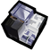
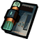
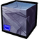
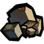
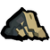

# 材料增强表（自动生成）

> 该文件由 `tools/generate_ark_item_table.lua` 自动生成，请勿手改。
>
> 生成命令：`lua tools/generate_ark_item_table.lua`

| 
图片
 | 
名称
 | 代码 | 掉落自 | 合成自 |
| --- | --- | --- | --- | --- |
|  | 龙门币 | `ark_gold` |  |  |
|  | 一张龙门币 | `ark_item_gold1` |  |  |
|  | 一叠龙门币 | `ark_item_gold2` |  | `ark_gold(龙门币)` |
|  | 一箱龙门币 | `ark_item_gold3` |  | `ark_gold(龙门币)` |
|  | 烧结核凝晶 | `ark_item_mtl_sl_shj` |  | `ark_item_mtl_sl_zyk(转质盐聚块)`, `ark_item_mtl_sl_plcf(切削原液)`, `ark_item_mtl_sl_rs(精炼溶剂)`, `ark_gold(龙门币)` |
|  | 晶体电子单元 | `ark_item_mtl_sl_oeu` |  | `ark_item_mtl_sl_oc4(晶体电路)`, `ark_item_mtl_sl_pgel4(聚合凝胶)`, `ark_item_mtl_sl_iam4(炽合金块)`, `ark_gold(龙门币)` |
|  | D32钢 | `ark_item_mtl_sl_ds` |  | `ark_item_mtl_sl_manganese2(三水锰矿)`, `ark_item_mtl_sl_pg2(五水研磨石)`, `ark_item_mtl_sl_rma7024(RMA70-24)`, `ark_gold(龙门币)` |
|  | 双极纳米片 | `ark_item_mtl_sl_bn` |  | `ark_item_mtl_sl_boss4(改量装置)`, `ark_item_mtl_sl_alcohol2(白马醇)`, `ark_gold(龙门币)` |
|  | 聚合剂 | `ark_item_mtl_sl_pp` |  | `ark_item_mtl_sl_g4(提纯源岩)`, `ark_item_mtl_sl_iron4(异铁块)`, `ark_item_mtl_sl_ketone4(酮阵列)`, `ark_gold(龙门币)` |
|  | 转质盐聚块 | `ark_item_mtl_sl_zyk` |  | `ark_item_mtl_sl_zy(转质盐组)`, `ark_item_mtl_sl_ss(半自然溶剂)`, `ark_item_mtl_sl_strg3(糖组)`, `ark_gold(龙门币)` |
|  | 环烃预制体 | `ark_item_mtl_sl_htt` |  | `ark_item_mtl_sl_ht(环烃聚质)`, `ark_item_mtl_sl_xw(褐素纤维)`, `ark_item_mtl_sl_zy(转质盐组)`, `ark_gold(龙门币)` |
|  | 转质盐组 | `ark_item_mtl_sl_zy` |  |  |
|  | 环烃聚质 | `ark_item_mtl_sl_ht` |  |  |
|  | 切削原液 | `ark_item_mtl_sl_plcf` |  | `ark_item_mtl_sl_ccf(化合切削液)`, `ark_item_mtl_sl_oc3(晶体元件)`, `ark_item_mtl_sl_rma7012(RMA70-12)`, `ark_gold(龙门币)` |
|  | 固化纤维板 | `ark_item_mtl_sl_xwb` |  | `ark_item_mtl_sl_xw(褐素纤维)`, `ark_item_mtl_sl_rush3(聚酸酯组)`, `ark_item_mtl_sl_g3(固源岩组)`, `ark_gold(龙门币)` |
|  | 化合切削液 | `ark_item_mtl_sl_ccf` |  |  |
|  | 褐素纤维 | `ark_item_mtl_sl_xw` |  |  |
|  | 精炼溶剂 | `ark_item_mtl_sl_rs` |  | `ark_item_mtl_sl_ss(半自然溶剂)`, `ark_item_mtl_sl_ccf(化合切削液)`, `ark_item_mtl_sl_pgel3(凝胶)`, `ark_gold(龙门币)` |
|  | 半自然溶剂 | `ark_item_mtl_sl_ss` |  |  |
|  | 晶体电路 | `ark_item_mtl_sl_oc4` |  | `ark_item_mtl_sl_oc3(晶体元件)`, `ark_item_mtl_sl_pgel3(凝胶)`, `ark_item_mtl_sl_iam3(炽合金)`, `ark_gold(龙门币)` |
|  | 晶体元件 | `ark_item_mtl_sl_oc3` |  |  |
|  | 炽合金块 | `ark_item_mtl_sl_iam4` |  | `ark_item_mtl_sl_boss3(全新装置)`, `ark_item_mtl_sl_pg1(研磨石)`, `ark_item_mtl_sl_iam3(炽合金)`, `ark_gold(龙门币)` |
|  | 炽合金 | `ark_item_mtl_sl_iam3` |  |  |
|  | 聚合凝胶 | `ark_item_mtl_sl_pgel4` |  | `ark_item_mtl_sl_iron3(异铁组)`, `ark_item_mtl_sl_pgel3(凝胶)`, `ark_item_mtl_sl_iam3(炽合金)`, `ark_gold(龙门币)` |
|  | 凝胶 | `ark_item_mtl_sl_pgel3` |  |  |
|  | 白马醇 | `ark_item_mtl_sl_alcohol2` |  | `ark_item_mtl_sl_alcohol1(扭转醇)`, `ark_item_mtl_sl_strg3(糖组)`, `ark_item_mtl_sl_rma7012(RMA70-12)`, `ark_gold(龙门币)` |
|  | 扭转醇 | `ark_item_mtl_sl_alcohol1` |  |  |
|  | 三水锰矿 | `ark_item_mtl_sl_manganese2` |  | `ark_item_mtl_sl_manganese1(轻锰矿)`, `ark_item_mtl_sl_rush3(聚酸酯组)`, `ark_item_mtl_sl_alcohol1(扭转醇)`, `ark_gold(龙门币)` |
|  | 轻锰矿 | `ark_item_mtl_sl_manganese1` |  |  |
|  | 五水研磨石 | `ark_item_mtl_sl_pg2` |  | `ark_item_mtl_sl_pg1(研磨石)`, `ark_item_mtl_sl_iron3(异铁组)`, `ark_item_mtl_sl_boss3(全新装置)`, `ark_gold(龙门币)` |
|  | 研磨石 | `ark_item_mtl_sl_pg1` |  |  |
|  | RMA70-24 | `ark_item_mtl_sl_rma7024` |  | `ark_item_mtl_sl_rma7012(RMA70-12)`, `ark_item_mtl_sl_g3(固源岩组)`, `ark_item_mtl_sl_ketone3(酮凝集组)`, `ark_gold(龙门币)` |
|  | RMA70-12 | `ark_item_mtl_sl_rma7012` |  |  |
|  | 提纯源岩 | `ark_item_mtl_sl_g4` |  | `ark_item_mtl_sl_g3(固源岩组)`, `ark_gold(龙门币)` |
|  | 固源岩组 | `ark_item_mtl_sl_g3` |  | `ark_item_mtl_sl_g2(固源岩)`, `ark_gold(龙门币)` |
|  | 固源岩 | `ark_item_mtl_sl_g2` |  | `ark_item_mtl_sl_g1(源岩)`, `ark_gold(龙门币)` |
|  | 源岩 | `ark_item_mtl_sl_g1` | `rock1`, `rock2`, `rock_flintless`, `rock_flintless_med`, `rock_flintless_low`, `cavein_boulder` |  |
|  | 改量装置 | `ark_item_mtl_sl_boss4` |  | `ark_item_mtl_sl_boss3(全新装置)`, `ark_item_mtl_sl_g3(固源岩组)`, `ark_item_mtl_sl_pg1(研磨石)`, `ark_gold(龙门币)` |
|  | 全新装置 | `ark_item_mtl_sl_boss3` |  | `ark_item_mtl_sl_boss2(装置)`, `ark_gold(龙门币)` |
|  | 装置 | `ark_item_mtl_sl_boss2` |  | `ark_item_mtl_sl_boss1(破损装置)`, `ark_gold(龙门币)` |
|  | 破损装置 | `ark_item_mtl_sl_boss1` |  |  |
|  | 聚酸酯块 | `ark_item_mtl_sl_rush4` |  | `ark_item_mtl_sl_rush3(聚酸酯组)`, `ark_item_mtl_sl_ketone3(酮凝集组)`, `ark_item_mtl_sl_alcohol1(扭转醇)`, `ark_gold(龙门币)` |
|  | 聚酸酯组 | `ark_item_mtl_sl_rush3` |  | `ark_item_mtl_sl_rush2(聚酸酯)`, `ark_gold(龙门币)` |
|  | 聚酸酯 | `ark_item_mtl_sl_rush2` |  | `ark_item_mtl_sl_rush1(酯原料)`, `ark_gold(龙门币)` |
|  | 酯原料 | `ark_item_mtl_sl_rush1` |  |  |
|  | 糖聚块 | `ark_item_mtl_sl_strg4` |  | `ark_item_mtl_sl_strg3(糖组)`, `ark_item_mtl_sl_iron3(异铁组)`, `ark_item_mtl_sl_manganese1(轻锰矿)`, `ark_gold(龙门币)` |
|  | 糖组 | `ark_item_mtl_sl_strg3` |  | `ark_item_mtl_sl_strg2(糖)`, `ark_gold(龙门币)` |
|  | 糖 | `ark_item_mtl_sl_strg2` |  | `ark_item_mtl_sl_strg1(代糖)`, `ark_gold(龙门币)` |
|  | 代糖 | `ark_item_mtl_sl_strg1` | `bee` |  |
|  | 异铁块 | `ark_item_mtl_sl_iron4` | `rock_moon_shell` | `ark_item_mtl_sl_iron3(异铁组)`, `ark_item_mtl_sl_boss3(全新装置)`, `ark_item_mtl_sl_rush3(聚酸酯组)`, `ark_gold(龙门币)` |
|  | 异铁组 | `ark_item_mtl_sl_iron3` | `rock_moon`, `rock_moon_shell` | `ark_item_mtl_sl_iron2(异铁)`, `ark_gold(龙门币)` |
|  | 异铁 | `ark_item_mtl_sl_iron2` | `rock2`, `rock1`, `rock_moon`, `rock_moon_shell` | `ark_item_mtl_sl_iron1(异铁碎片)`, `ark_gold(龙门币)` |
|  | 异铁碎片 | `ark_item_mtl_sl_iron1` | `rock2`, `rock1`, `rock_moon`, `rock_moon_shell` |  |
|  | 酮阵列 | `ark_item_mtl_sl_ketone4` | `bearger`, `dragonfly`, `deerclops`, `moose` | `ark_item_mtl_sl_ketone3(酮凝集组)`, `ark_item_mtl_sl_strg3(糖组)`, `ark_item_mtl_sl_manganese1(轻锰矿)`, `ark_gold(龙门币)` |
|  | 酮凝集组 | `ark_item_mtl_sl_ketone3` | `beefalo`, `spat`, `crabking`, `koalefant_summer`, `koalefant_winter`, `bearger`, `dragonfly`, `deerclops`, `moose` | `ark_item_mtl_sl_ketone2(酮凝集)`, `ark_gold(龙门币)` |
|  | 酮凝集 | `ark_item_mtl_sl_ketone2` | `pigman`, `pigguard`, `bunnyman`, `walrus`, `little_walrus`, `tallbird`, `babybeefalo`, `beefalo`, `spat`, `crabking`, `koalefant_summer`, `koalefant_winter`, `bearger`, `dragonfly`, `deerclops`, `moose` | `ark_item_mtl_sl_ketone1(双酮)`, `ark_gold(龙门币)` |
|  | 双酮 | `ark_item_mtl_sl_ketone1` | `rabbit`, `mole`, `monkey`, `penguin` |  |
|  | 技巧概要·卷1 | `ark_item_mtl_skill1` |  |  |
|  | 技巧概要·卷2 | `ark_item_mtl_skill2` |  |  |
|  | 技巧概要·卷3 | `ark_item_mtl_skill3` |  |  |
